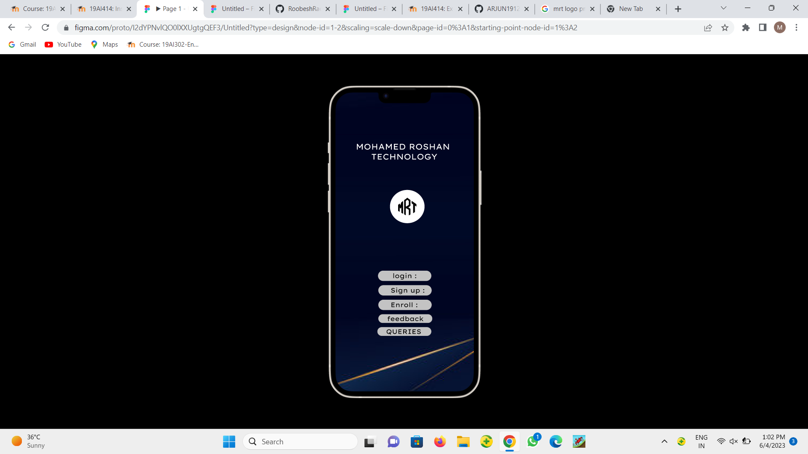
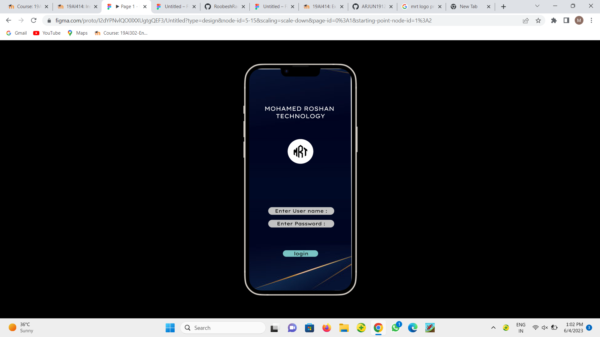
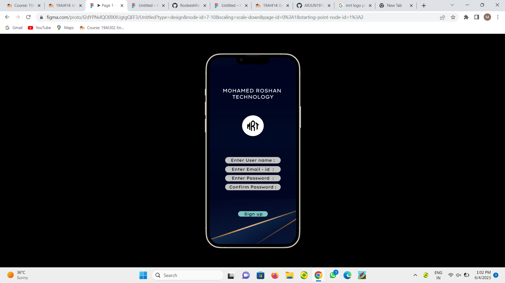
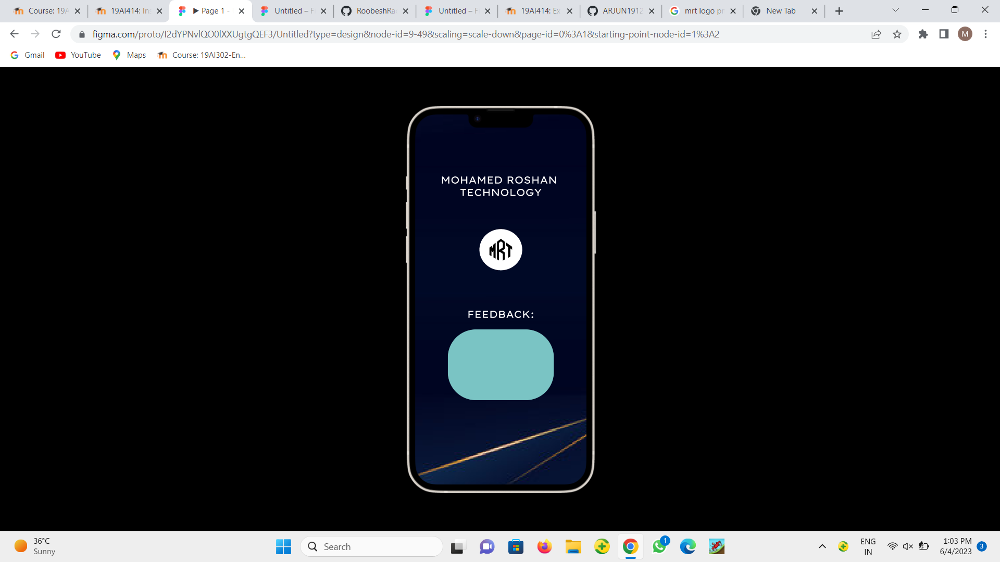
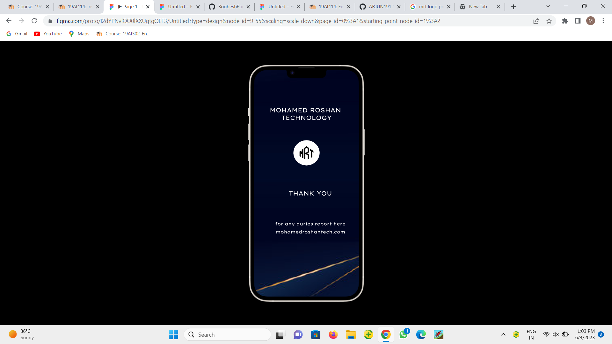

# Event Registration Web Application

# AIM:
To design, develop and deploy a web application for event registration.

# DESIGN STEPS:

## Step 1:

Create a new frame.

## Step 2:

Select any one preset size of your choice.

## Step 3:

Select the shapes you need.

## Step 4:

Import images as needed.

## Step 5:

Create pages based on your need and link them.

## Step 6:

Validate the CSS code.

## Step 7:

Publish the website in the given URL.

# DESIGN TOOL:

Figma

# PROGRAM :
```css 
/* iPhone 13 Pro Max */


position: relative;
width: 428px;
height: 926px;

background: #FFFFFF;

/* MOHAMED ROSHAN TECHNOLOGY */


position: absolute;
width: 359px;
height: 106px;
left: 34px;
top: 152px;

font-family: 'Lexend Exa';
font-style: normal;
font-weight: 400;
font-size: 25px;
line-height: 31px;
text-align: center;

color: #FFFFFF;

/* Ellipse 1 */


position: absolute;
width: 107px;
height: 103px;
left: 161px;
top: 287px;

background: url(mrlogo.png);

/* login */


position: absolute;
width: 165px;
height: 32px;
left: 132px;
top: 552px;


/* signup */


position: absolute;
width: 165px;
height: 32px;
left: 133px;
top: 597px;


/* Enroll */


position: absolute;
width: 165px;
height: 32px;
left: 133px;
top: 642px;


/* Feedback */


position: absolute;
width: 167px;
height: 27px;
left: 133px;
top: 687px;


/* Quries */


position: absolute;
width: 167px;
height: 27px;
left: 130px;
top: 727px;

/* ENU */


position: absolute;
width: 296px;
height: 32px;
left: 69px;
top: 578px;


/* EP */


position: absolute;
width: 296px;
height: 32px;
left: 69px;
top: 631px;


/* login2 */


position: absolute;
width: 147px;
height: 27px;
left: 141px;
top: 758px;

/* EUN2 */


position: absolute;
width: 296px;
height: 32px;
left: 66px;
top: 494px;


/* CP */


position: absolute;
width: 296px;
height: 32px;
left: 66px;
top: 627px;


/* EEI */


position: absolute;
width: 296px;
height: 32px;
left: 66px;
top: 539px;


/* EP2 */


position: absolute;
width: 296px;
height: 32px;
left: 66px;
top: 583px;


/* SUP */


position: absolute;
width: 147px;
height: 27px;
left: 141px;
top: 763px;

/* CSE ECE EEE AIDS AIML MECH */


position: absolute;
width: 123px;
height: 186px;
left: 146px;
top: 563px;

font-family: 'Lexend Exa';
font-style: normal;
font-weight: 400;
font-size: 25px;
line-height: 31px;

color: #FFFFFF;


/* DEPARTMENTS */


position: absolute;
width: 218px;
height: 31px;
left: 103px;
top: 499px;

font-family: 'Lexend Exa';
font-style: normal;
font-weight: 400;
font-size: 25px;
line-height: 31px;
text-align: center;
text-decoration-line: underline;

color: #FFFFFF;

/* CONTACT US 9899899895 8965417636 */


position: absolute;
width: 188px;
height: 124px;
left: 133px;
top: 476px;

font-family: 'Lexend Exa';
font-style: normal;
font-weight: 400;
font-size: 25px;
line-height: 31px;
text-align: center;
text-decoration-line: underline;

color: #FFFFFF;


/* E-mail mrt@gmail.com */


position: absolute;
width: 242px;
height: 93px;
left: 106px;
top: 646px;

font-family: 'Lexend Exa';
font-style: normal;
font-weight: 400;
font-size: 25px;
line-height: 31px;
text-align: center;
text-decoration-line: underline;

color: #FFFFFF;

/* FEEDBACK: */


position: absolute;
width: 168px;
height: 31px;
left: 130px;
top: 484px;

font-family: 'Lexend Exa';
font-style: normal;
font-weight: 400;
font-size: 25px;
line-height: 31px;
text-align: center;

color: #FFFFFF;


/* Rectangle 4 */


position: absolute;
width: 265px;
height: 177px;
left: 82px;
top: 538px;

background: #7AC4C4;
border-radius: 70px;

/* THANK YOU */


position: absolute;
width: 177px;
height: 31px;
left: 142px;
top: 488px;

font-family: 'Lexend Exa';
font-style: normal;
font-weight: 400;
font-size: 25px;
line-height: 31px;
text-align: center;

color: #FFFFFF;


/* for any quries report here */


position: absolute;
width: 287px;
height: 23px;
left: 87px;
top: 617px;

font-family: 'Lexend Exa';
font-style: normal;
font-weight: 400;
font-size: 18px;
line-height: 22px;
/* identical to box height */

text-align: center;

color: #FFFFFF;


/* mohamedroshantech.com */


position: absolute;
width: 285px;
height: 23px;
left: 88px;
top: 650px;

font-family: 'Lexend Exa';
font-style: normal;
font-weight: 400;
font-size: 18px;
line-height: 22px;
/* identical to box height */

text-align: center;

color: #FFFFFF;

```
# HOME PAGE :



# LOGIN PAGE :



# SIGN-UP PAGE :



# ENROLL PAGE :


# CONTACT PAGE :


# FEEDBACK PAGE :



# THANK-YOU PAGE :



# RESULT:
The program to design, develop and deploy a web application for event registration is completed successfully.